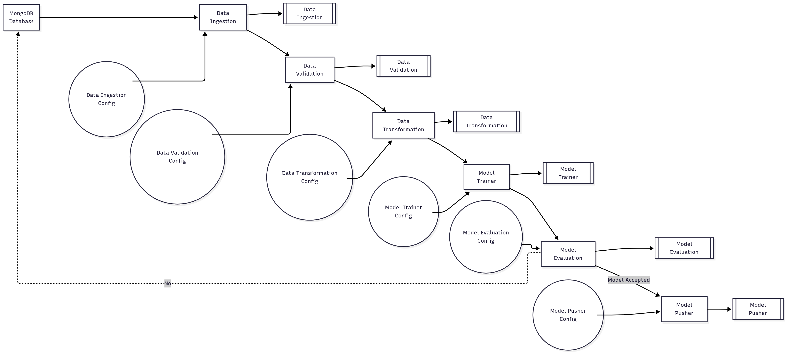
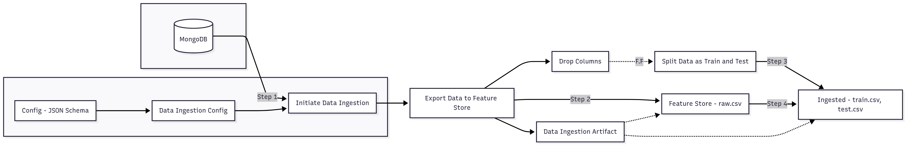
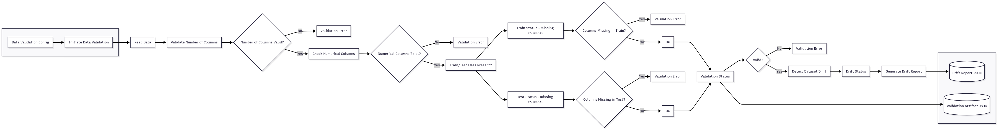
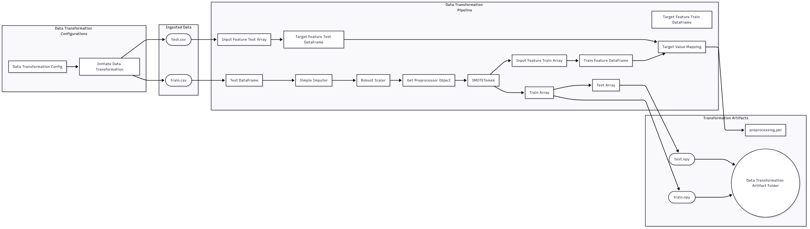
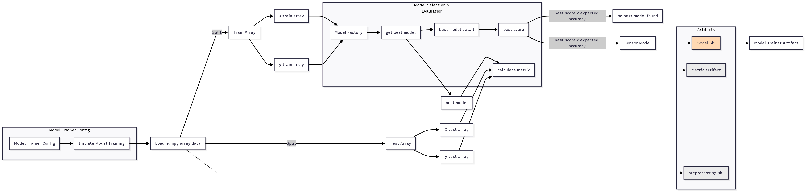
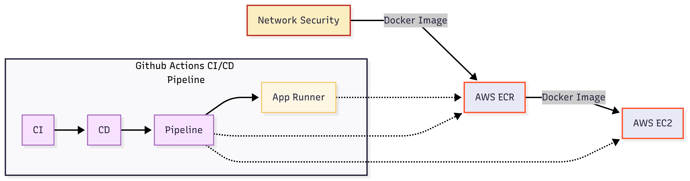

# End-to-End Machine Learning Pipeline

## 1. Project Overview

This project provides a comprehensive, production-ready machine learning (ML) pipeline that automates every stage: data ingestion, validation, transformation, model training, evaluation, and deployment. The workflow emphasizes robust configuration management, modular artifact tracking, and seamless cloud-integrated deployment. Deployment leverages Docker, GitHub Actions (CI/CD), and AWS services for secure, scalable automation.

---

## 2. Workflow Flowcharts

Each pipeline stage is designed as a modular, configurable component, following best industry practices:

- **Data Ingestion:** Configurable extraction of tabular data (e.g., MongoDB), initial storage as raw CSV, and reproducible train/test splitting—while archiving all relevant artifacts.
- **Data Validation:** Automated schema checks, feature/count validation, data drift detection, and reporting—producing JSON status and drift artifacts for full traceability.
- **Data Transformation:** Systematic preprocessing (imputation, scaling), label mapping, and synthetic augmentation (SMOTETomek), resulting in ready-to-use NumPy arrays and reusable preprocessor objects.
- **Model Training & Selection:** Automated learn/test splits, automated model selection via a model factory, evaluation metric calculation, artifact tracking of the best model, and robust failover if requirements aren't met.
- **Model Deployment:** Secure Dockerization, end-to-end CI/CD (GitHub Actions), image management via AWS ECR, and deployment onto AWS EC2 (optionally App Runner), integrated with strict network security controls.

---

## 3. Section Summaries 

### Data Ingestion
- **Function:** Load raw data from the database, perform feature selection, export to a feature store, and split into train/test files.
- **Artifacts:** Configuration JSON, data ingestion artifacts (raw/train/test CSVs), and ingestion metadata.

### Data Validation
- **Function:** Validate schema and feature counts/types, check for missing columns, and perform data drift detection between datasets.
- **Artifacts:** Validation status JSON, drift report JSON, error logs as applicable.

### Data Transformation
- **Function:** Read train/test CSVs, apply imputation and robust scaling, label/target mapping, and apply SMOTETomek for class balancing; output arrays and preprocessor objects.
- **Artifacts:** Preprocessor pickle, `train.npy` & `test.npy`, organized artifact directories.

### Model Training and Selection
- **Function:** Load preprocessed arrays, split features/labels, use a model factory for candidate selection and metric optimization, and enforce quality thresholds.
- **Artifacts:** Serialized model (`.pkl`), pipeline preprocessor, metric artifact files, or error notification.

### Model Deployment
- **Function:** Build Docker images, automate CI/CD with GitHub Actions, push images to AWS ECR, and deploy on AWS EC2 (or App Runner).
- **Security:** Integrated network security configuration for safe, compliant production deployment.

---

## 4. Usage

- **Prerequisites:** Docker, AWS CLI, AWS credentials, GitHub Actions configured for your repository.
- **Setup:** Configure each module with YAML/JSON files. Update database credentials and AWS details where required.
- **Running Locally:** Use Docker Compose or execute Python modules manually for full end-to-end (E2E) tests.
- **Production Deployment:** Push/merge triggers GitHub Actions; pipeline builds and pushes Docker image to AWS ECR, and deploys to AWS EC2 or App Runner automatically.

